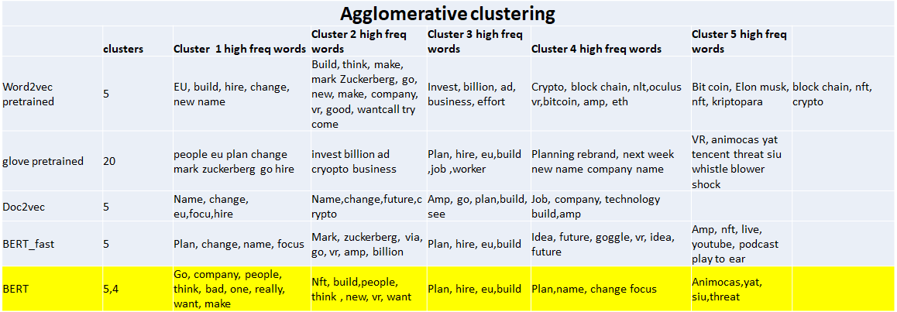
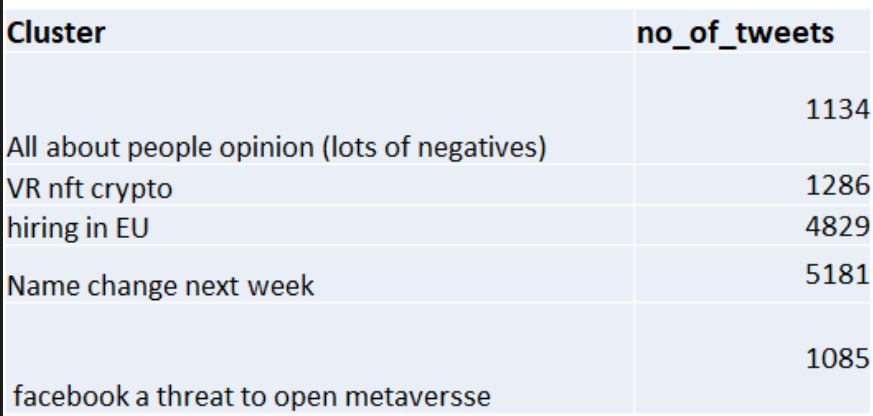
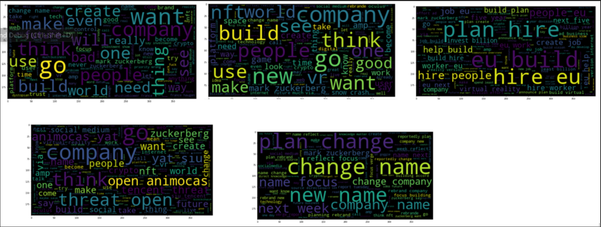

# Analysis on Facebook's rebranding to meta using Tweets

Facebook currently rebranded itself to Meta on October 28th allowing it to focus more on its metaverse. On October 19th, Facebook first annouced its plan on new name 'Meta'. However, on Oct 4th its metaverse experience widespread outage over 6 hours. Thus, for this analysis, the tweets that have the words 'facebook' and  'metaverse' in them from Oct 1st to Oct 27th.  

The objective of this analysis is to analyze tweets to deteremine the public opinion regarding facebook's rebranding. 

# Webscrapping Twitter Data: 

Snscrape a tweet-scraping library, is used to obtain historical tweets without the restrictions of Twitters API.

The search query 'facebook metaverse' is used to obtain tweets that have both words present in them from Oct 1st to Nov 1st.

# PREPROCESS DATA
Preprocessing the text is an important part of any natural language problem.For preprocessing the tweets the following are done.
*   Remove punctuations
*   Remove tags, @usernames,numbers
*   Remove emojis 
*   Remove stopwords - Stopwords are the words that commonly occurs and doesnot provide any information.
*   Tokenization - process of converting the whole sentence to pieces of words which are called tokens

*   Lemmatization - process of extracting the root word. Stemming can also be used but it will cut the word in a crude way. so I did not do stemming
   
# Word Embeddings

The word embeddings are the dense vector which are represented by float values that are leaarned by the language model. The dense vector for the simlar words will be close to each other. For converting the tweets to vectors, the following word embedding methods were used and the results were compared 

*   Word2vec
*   GloVe
*   Doc2vec
*   BERT

# GloVe: Global Vectors for Word Representation

This model is a log-bilinear regression model in which global corpus statistics are captured. Glove learns the word vector such that the dot product of the word vector equals the logarithm of the words' probability of co-occurance.The model shows ratios of word-word co-occurrence probabilities gives same meaning.

https://nlp.stanford.edu/projects/glove/

# Word2Vec - pretrained model

**Word2Vec**

Word2Vec is a word embedding model that captures the semantic and syntactics of the words in our tweets. Thus, words that are similar in context will have similar word vectors. 

Word2Vec is a probabilistic method by [Mikolov et al., 2013]. The paper proposed two methods, Continuous Bag of Words (CBOW) and Continous Skip-Gram.

1. Continous Bag of Words (CBOW) - predicts words from surrounding context words without considering the order of the context words. 
2. Continous Skip-Gram - predicts probability of surround context words taking the word itself as input. This method captures the syntactic and semantic word relationships precisely. 

# Paragraph vector model -Doc2vec

This is an unsupervised algorithm which comes up with fixed length numerical representation using the sentences. Word2vec model gives vector representation of the words and for the whole document embedding we need to average the features of all words in the document. Instead Doc2vec model is trained in a way that it holds the information of document in one of the tokens and provides the embedding for the whole sentence.

# Clustering

Clustering is an unsupervised learning method that helps in grouping the similar datapoints.Clustering will be helpful for grouping interpretting unlabelled data. Here, I am using 2 algorithms.

1.  K-means Clustering - It is a centroid based model which will initialize centroids and assign datapoints to the nearest centroid.  It iterates to find local maxima in each iteration.

2.  Agglomeratve clustering - A hierrachical clustering algorithm that starts by assigning each point to seperate clusters and then combines them based on the distance till all the points comes in to one big cluster. Using the dendrogram we can figure out how many clusters in such a way that there is a reasonable distance.

# Results and Discussion
**Glove :**
I used 2 and 3 clusters for kmeans algorithm and the resultant word cloud shows that if I use three clusters, then some terms are more common in all the clusters. The term ‘change’,’ name’ is common in three of the clusters as shown below. Also word ‘go’ and ‘amp’ is widely present in two clusters

When I used 2 clusters, the first cluster shows keywords ‘name’, ‘change’, the second one shows ‘hire’,’eu’,’build’  So I chose 2.

With Agglomerative clustering, I was able to get 20 clusters in which 5 of them are significant and the others are outliers so I removed it. 

**WORD2VEC:**
When I tried K means on word2vec, I found 4 as optimum number of cluster based on elbow graph and silloutte graph. Three of those clusters were having name change tweets. Comparitively glove works better for my work. That is because glove is trained on twitter dataset and word2vec on wikipidia that is why glove is better for  my work.
Although k means was bad, agglomerative clustering was able to figure out three clusters, one on hiring, another on crypto related facts, one with the investment in billions, one with same as crypto and another one is just noise. 

**Doc2vec:**	
I tried to train the doc2vec algorithm on my corpus, But the performance is very bad. The clusters in both k means and agglomerative shows that the clusters are not seperated well its kind of mixed up.

**all-MiniLM-L6-v2**
I have got 4 clusters, which are pretty good. First cluster is about crypto and billion dollar investment in the next few years. The second cluster is all about hiring. Third one is people general opinion and the last one is just about the name change.
With agglomerative clustering I got one new cluster showing the live sessions like you tube, podcast. The agglomerative clustering tries to find more fine clusters.

**BERT base model**

I found the bert base model is much better. The clusters are not redundant and the interpratation is also much better.Agglomerative clustering gives one cluster that is more of people opinion and the others are related to nft,vr, hiring and siu's comment of facebook is a threat to open metaverse.

# Conclusion
Based on the clusters, Below are the interpretations about the tweets

*   People are curious about VR, nft, crypto

*   People have discussions about facebook hiring heavily in European union.
*   people talking about "Facebook a threat to open metaverse"

*   General discussions about name change(both positive and negative)

# References:

*   I have done this project as the extension of the project I do in the machine learning class along with my team members.
*   Jeffrey Pennington, Richard Socher, and Christopher D. Manning. 2014. GloVe: Global Vectors for Word Representation. 
https://nlp.stanford.edu/projects/glove/ 

* https://radimrehurek.com/gensim/auto_examples/tutorials/run_doc2vec_lee.html#sphx-glr-auto-examples-tutorials-run-doc2vec-lee-py
*   https://cs.stanford.edu/~quocle/paragraph_vector.pdf
*   https://nlp.stanford.edu/projects/glove/

*   https://arxiv.org/pdf/1301.3781.pdf (Word2vec paper)
*   https://arxiv.org/abs/1810.04805 (BERT model)
*   https://arxiv.org/abs/1908.10084 (sentence BERT - transformer)

*   https://huggingface.co/sentence-transformers/all-MiniLM-L6-v2
  

